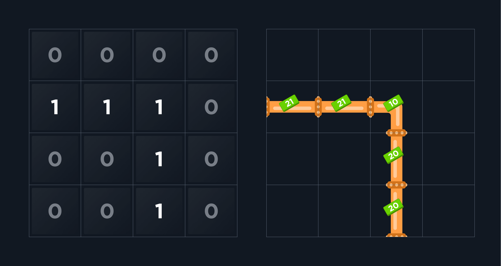
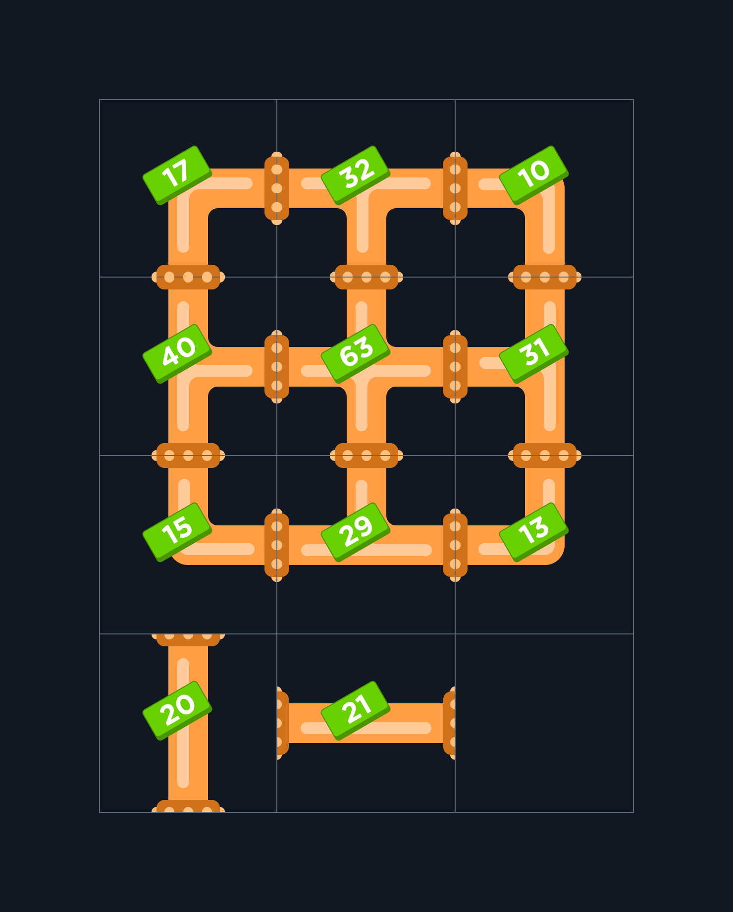

Америка 90-х годов. Повсеместны синдикаты и картельные сговоры. У вас на руках список торговых сделок крупных компаний за последний год.

Если сделки состоят из цепочки, в которой первая компания и последняя совпадают, образуя круг компаний, то вы наткнулись на очередной синдикат. Например, если компания A заключила сделку с B, та в свою очередь с C, а C - с A, то перед вами незаконный торговый союз. 

Найдите все такие связи и выведите количество синдикатов. То есть необходимо найти количество уникальных цепочек, в которых первая и последняя компании совпадают. Отметим, что цепочки с одинаковым набором, например, a-b-c-a и b-c-a-b - это один и тот же синдикат. 

Случаев, когда компании заключали сделки напрямую ("a-b", "b-a") нет.

Подсказка: Если нарисовать все связи с помощью однонаправленного графа, то количество синдикатов - это количество петель в этом графе. 

 Ввод: 
deal - массив строк deal["a-bc..."], где a - компания, заключившая сделку с b,c… - компании, с которыми была совершена сделка (количество таких компаний не ограничено). Если у какой-либо компании после названия нет тире и далее списка, то у компании нет никаких сделок. 0<length(deal)<=10

 Вывод:  
integer - количество синдикатов

Examples:

deal = ["a-b", "b-c", "c-a"]
getResult(deal) = 1

deal = ["a-b","b-c","c-ad","d"]
getResult(deal) = 1

Сантехник устал от того, что ему приходится самому рассчитывать количество и цену каждой трубы. Поэтому он решил написать программу, которая будет принимать бинарную схему труб (0-нет трубы, 1- есть труба) и выдавать стоимость проекта, в зависимости от типа каждой трубы. 

Цены на трубы постоянные и указаны на рисунке, берем их именно отсюда:

Примечание:  

если труба находится у начала или конца матрицы, то считаем, что за границей находится другая труба
труба всегда одна и нигде не прерывается
нам тоже показалось странным, что одинаковые трубы под разными углами могут стоить дороже, мы считаем, что сантехника обманывают, но сообщить ему почему-то не решились
На входе: 

scheme - бинарная матрица схемы труб, scheme[i]=0|1
На выходе: 

Integer - общая стоимость всех труб, которые надо купить

Пример:

scheme = [
'0-0-0-0',
'1-1-1-0',
'0-0-1-0',
'0-0-1-0']

getResult(scheme) → 92 // 21+21+10+20+20